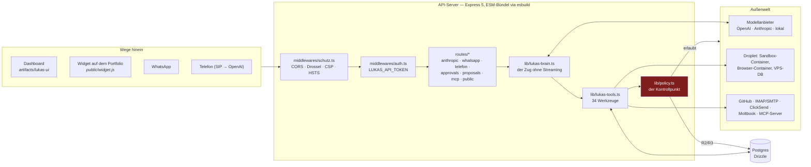
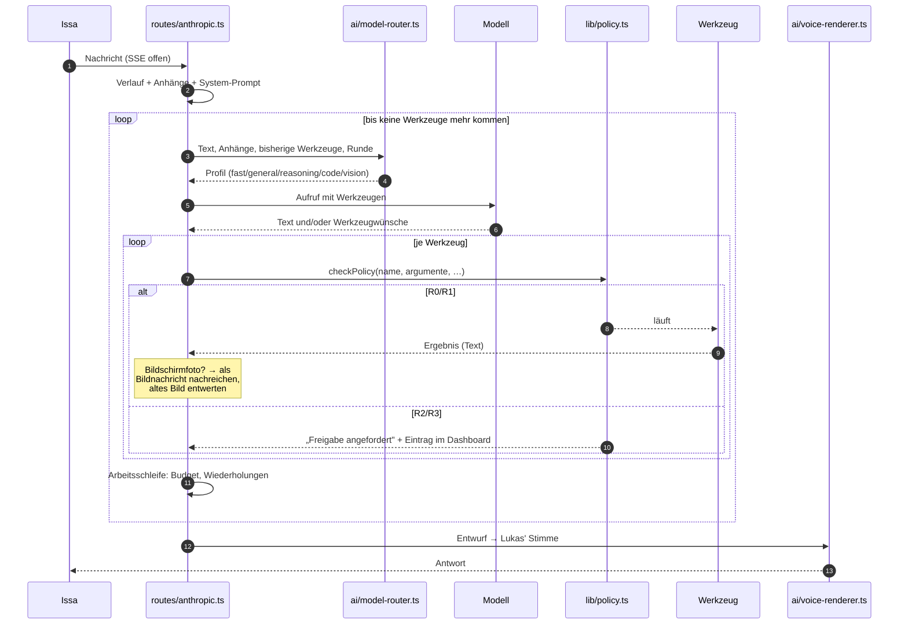
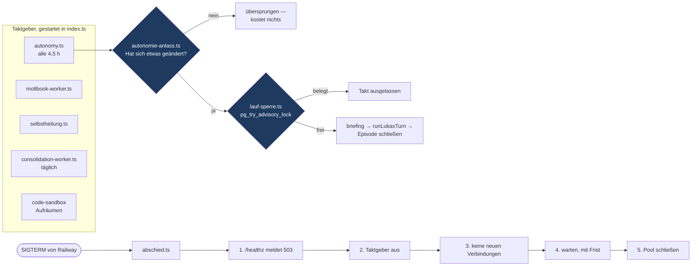

# Architektur

Wie L.U.K.A.S. tatsächlich gebaut ist — nicht, wie es klingen soll. Jeder
Kasten hier ist eine Datei, die es gibt.

---

## 1. Der Aufbau im Groben



**Ein Monorepo mit npm-Workspaces:**

| Paket | Was es ist |
|---|---|
| `artifacts/api-server` | Express 5, als ein einziges ESM-Bündel gebaut (`build.mjs`) |
| `artifacts/lukas-ui` | Dashboard: React, Vite, Tailwind v4, wouter |
| `artifacts/landing-page` | die öffentliche Seite |
| `lib/db` | Drizzle-Schema und der Postgres-Pool |
| `lib/api-zod` | die Formen, die beide Seiten teilen |

Railway baut aus `main`. `start:deploy` führt vor dem Start `db:push` aus —
Schemaänderungen gehen also von selbst mit; schlägt es fehl, startet der Server
trotzdem.

---

## 2. Ein Zug, von der Nachricht bis zur Antwort



Drei Dinge, die dabei nicht selbstverständlich sind:

- **Der Kontrollpunkt sitzt nach dem Modell und vor dem Werkzeug.** Nicht davor
  (dann autorisierte das Modell) und nicht danach (dann wäre es passiert).
- **Es gibt keine feste Rundenzahl.** Braucht Lukas zwanzig Befehle, macht er
  zwanzig. Gegen Im-Kreis-Laufen hilft ein Hinweis, keine Bremse
  (`lib/arbeitsschleife.ts`); die Grenze ist ein Token- und Zeitbudget pro Zug.
- **Die Ausgabeschicht ist eine eigene Runde.** Welches Modell intern gearbeitet
  hat, ist außen nicht zu sehen — ein Anbieterwechsel wird so kein
  Persönlichkeitswechsel.

---

## 3. Wie Lukas eine Seite bedient — und sie sieht

```mermaid
sequenceDiagram
    autonumber
    participant M as Modell
    participant T as lukas-tools.ts
    participant B as lib/browser.ts
    participant D as Droplet (SSH)
    participant C as Browser-Container
    participant A as lib/bildablage.ts

    M->>T: browser_do(sitzung, schritte mit {{PASSWORT}})
    T->>T: Zugangsdaten aus der Umgebung holen
    Note over T,M: Der echte Wert kommt NIE<br/>in den Prompt zurück
    T->>B: bedienePage(sitzung, schritte, zugang)
    B->>D: Skript + plan.json schreiben
    B->>D: docker exec -e LUKAS_WEB_* … node bedienen.cjs 'sitzung'
    D->>C: Playwright, dauerhaftes Profil im Volume
    C->>C: Platzhalter erst HIER ersetzen
    C->>C: klicken, tippen, absenden, Bericht je Schritt
    C-->>B: {ok, schritte, felder, text, bild}
    B-->>T: Ergebnis
    T->>A: merkeBild(conversationId, JPEG)
    T-->>M: Text + Protokoll der Schritte
    Note over A,M: Die Schleife holt das Bild ab und<br/>hängt es als echte Bildnachricht an;<br/>der Router schaltet auf ein Modell mit Augen
```

Die zwei Entscheidungen, die das trägt:

1. **Dauerhaftes Profil** (`launchPersistentContext` + Docker-Volume). Sonst
   müsste sich Lukas bei jedem einzelnen Werkzeugaufruf neu anmelden — bei
   Diensten mit Bestätigungsmail schlicht unmöglich.
2. **Zugangsdaten kommen nie durch das Modell.** Im Plan steht `{{PASSWORT}}`,
   eingesetzt wird im Container aus einer Umgebungsvariablen.

---

## 4. Das Gedächtnis

```mermaid
flowchart TB
    ein["Was hereinkommt"] --> writer["memory-writer.ts<br/>Episoden öffnen/schließen"]
    writer --> pg[("memories · goals · diary ·<br/>episodes · emotions")]
    pg --> graph["memory-graph.ts<br/>Knoten und Kanten,<br/>Lauf über beide Richtungen"]
    pg --> retrieval["memory-retrieval.ts<br/>was zu dieser Frage passt"]
    retrieval --> prompt["system-prompt.ts"]
    graph --> gehirn["gehirn.ts<br/>Momentaufnahme"]
    gehirn --> obsidian["obsidian-sync.ts<br/>Vault + JSON Canvas"]
    gehirn --> ui["3D-Ansicht im Dashboard<br/>(three.js, kräftegerichtet)"]
    konsol["consolidation-worker.ts<br/>täglich"] --> pg
    prompt --> brain["lukas-brain.ts"]

    oeffentlich["public-prompt.ts"] -.->|"nur als public<br/>markierte Erinnerungen"| fremde["Fremde: Widget,<br/>WhatsApp, Anrufer"]
```

---

## 5. Die Hintergrundläufe



Zwei Tore, zwei verschiedene Zwecke:

- **`autonomie-anlass.ts`** spart Geld: hat sich seit dem letzten Lauf nichts
  getan, wird gar nicht erst gedacht.
- **`lauf-sperre.ts`** verhindert Doppelarbeit: ein Lauf darf 25 Minuten
  dauern, der Takt beträgt 30 — das reicht nicht als Abstand. Die Sperre hängt
  an der Datenbankverbindung, fällt also mit dem Prozess und bleibt nach einem
  Abschuss nicht hängen.

---

## 6. Modellwahl

`ai/model-router.ts` entscheidet **pro Runde** neu, nicht einmal pro Gespräch:

| Auslöser | Profil |
|---|---|
| Bilder im Verlauf (auch ein Bildschirmfoto aus `browser_do`) | `vision` |
| `execute_command`, GitHub-Werkzeuge, oder der Text sieht nach Code aus | `code` |
| lange, verschachtelte Aufgaben | `reasoning` |
| kurzer Austausch | `fast` |
| sonst | `general` |

`ai/context-window.ts` kürzt, bevor abgeschickt wird — Altes zuerst, ein Bild
mit rund 2.500 Tokens veranschlagt statt mit der Länge seiner Base64-Zeichen.
`ai/model-client.ts` setzt die Cache-Marken und zählt Verbrauch mit.

---

## 7. Was wo liegt

```
artifacts/api-server/src/
├── index.ts              Start, Taktgeber, Abschied
├── app.ts                Middleware-Kette
├── middlewares/          schutz.ts (CORS/Drossel/CSP) · auth.ts
├── routes/               12 Router + index — anthropic (Chat, SSE) ist der größte
└── lib/
    ├── policy.ts         DER Kontrollpunkt
    ├── lukas-brain.ts    ein Zug ohne Streaming (WhatsApp, autonom)
    ├── lukas-tools.ts    die Werkzeuge und ihre Ausführung
    ├── lukas-soul.ts     wer er ist
    ├── arbeitsschleife.ts Budget und Wiederholungserkennung
    ├── netzschutz.ts     SSRF, IP angeheftet
    ├── lauf-sperre.ts    Advisory Locks
    ├── abschied.ts       SIGTERM
    ├── bildablage.ts     Bilder aus Werkzeugen → Modellkontext
    ├── browser*.ts       lesen, bedienen, sehen
    ├── memory-*.ts       schreiben, abrufen, verknüpfen
    └── ai/               Router, Client, Kontextfenster, Stimme, Sprache
```
