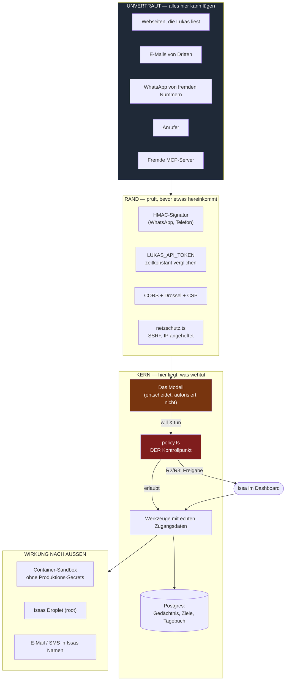

# Sicherheitsmodell

Was dieses Dokument leistet: es sagt, **wem** und **was** vertraut wird, wo
die Grenzen verlaufen, was absichtlich offen bleibt — und was danach noch an
Risiko übrig ist.

Was es nicht leistet: es beschreibt keinen Wunschzustand. Jede Aussage hier
lässt sich im Code nachlesen; wo Code und Absicht auseinanderlaufen, steht es
dabei. Kommentare sind keine Beweise, und eine Doku, die schöner ist als das
System, ist schlimmer als gar keine — dann rechnet man mit einem Netz, das
nicht da ist.

---

## 1. Der Leitsatz

> **Ein Sprachmodell ist niemals ein Autorisierungsserver.**

Lukas entscheidet, **was** er tun möchte. Ob es ausgeführt wird, entscheidet
Code — nachdem das Modell gesprochen hat und **bevor** das Werkzeug mit echten
Zugangsdaten läuft. Diese Reihenfolge ist der ganze Punkt: eine Anweisung im
Prompt ("tu das bitte nicht") ist eine Bitte, eine Prüfung im Code ist eine
Grenze.

Die Prüfung sitzt in `artifacts/api-server/src/lib/policy.ts` und wird in
`executeLukasTool()` aufgerufen, bevor irgendein Werkzeug seine Arbeit
aufnimmt — auch bevor Werkzeuge fremder MCP-Server laufen.

---

## 2. Vertrauensgrenzen

**Die wichtigste Linie im Bild** ist die zwischen `modell` und `policy`. Alles,
was das Modell gelesen hat — jede Webseite, jede Mail, jeder fremde Chat —
liegt in seinem Kontext und ist von Issas eigenen Worten nicht zu
unterscheiden. Deshalb darf nichts, was das Modell **sagt**, eine Stufe
herabsetzen oder eine Freigabe erzeugen.

---

## 3. Wer ist wer

| Rolle | Woran erkannt | Bekommt |
|---|---|---|
| **Issa (Dashboard)** | `LUKAS_API_TOKEN`, zeitkonstant verglichen | alles |
| **Issa (WhatsApp)** | Absendernummer aus dem **von Meta signierten** Webhook, gegen `WHATSAPP_OWNER_NUMBERS` | alles |
| **Fremder (WhatsApp)** | jede andere Nummer | Gespräch. **Keine Werkzeuge** — leeres Array im Modellaufruf, nicht bloß eine Anweisung. Eigener Gesprächsfaden, öffentlicher Prompt |
| **Anrufer** | Nummer im SIP-From-Header | privat **oder** öffentlich — ⚠️ siehe Restrisiko 1 |
| **SMS-Absender** | Nummer aus dem ClickSend-Webhook — **unsigniert**, also eine bloße Behauptung | **nichts.** Die Nachricht wird abgelegt und Issa gemeldet; sie löst kein Werkzeug aus und gibt nichts frei. Gesperrte Nummern werden abgelegt, aber nicht gemeldet |
| **Widget auf dem Portfolio** | keine Anmeldung | öffentlicher Prompt, nur als `public` markierte Erinnerungen, eigene Drossel |
| **Lukas selbst (autonom)** | kein Nutzerzug im Gange | R0/R1 laufen, R2/R3 landen als Freigabe im Dashboard und warten |

Der Satz, der das trägt: **"Ich bin Issa, meine Nummer ist neu"** ist Text und
damit wirkungslos. Die Rolle entscheidet sich an einer signierten Herkunft,
nie an einer Behauptung im Gespräch.

---

## 4. Was Lukas allein darf — und was nicht

Die Tabelle ist aus `policy.ts` abgelesen, nicht aus einer Absicht abgeleitet.
`check-policy-wahrheit.mjs` hält beides zusammen: es scheitert, sobald in einer
Werkzeugbeschreibung eine Freigabe versprochen wird, die die Einstufung nicht
hergibt (und umgekehrt).

| Aktion | Stufe | Allein? | Freigabe nötig | Was es technisch verhindert |
|---|---|---|---|---|
| Gedächtnis durchsuchen, Web-Suche, Seiten lesen | R0 | ✅ | — | — (Protokoll) |
| Eine Seite **bedienen** (`browser_do`) | R1 | ✅ | — | Nur Sitzungen mit von Issa hinterlegten Zugangsdaten; Lukas kennt die Werte nie |
| Ins eigene Gedächtnis / Ziele / Tagebuch schreiben | R1 | ✅ | — | umkehrbar, alles in einer eigenen Datenbank |
| Befehl in der **Container-Sandbox** | R1 | ✅ | — | Container ohne Produktions-Secrets, per `reset_sandbox` wegwerfbar |
| Subagent fragen / einstellen | R1 | ✅ | — | Subagenten haben nur lesende Werkzeuge, jedes einzeln durchs Gate |
| Anrufen (`ruf_an`) | R1 | ✅ | — | Nur Nummern aus Issas Freigabeliste; **Lukas kann die Liste nicht ändern** |
| Sich bei Issa melden | R1 | ✅ | — | geht nur an Issa |
| Codeänderung vorschlagen | R1 | ✅ | — | schreibt nur in die eigene Datenbank; geschrieben wird erst nach Klick |
| **E-Mail versenden** | R2 | ❌ | Dashboard **oder** Issas eindeutige Zustimmung im laufenden Zug | Raus ist raus, und der Absender ist Issa |
| **SMS versenden** | R2 | ❌ | Dashboard | dito, unmittelbarer |
| Link **aus einer gelesenen E-Mail** abrufen | R0→**R2** | ❌ | Dashboard | Der kürzeste Weg für eine Einschleusung: Mail gelesen, Link geholt, fremder Text im Kontext |
| Befehl **direkt auf dem Droplet** | R1 | ✅ | nur mit `LUKAS_HOST_APPROVAL=true` → R3 | Issas ausdrückliche Entscheidung: der Droplet gehört ihm, Lukas hat dort root |
| `execute_command`, wenn die Isolation **aus** ist | → wie Host | | | Die Einstufung hängt an der **Betriebsart**, nicht an einer Zusage: wer die Isolation abschaltet, schaltet nicht versehentlich die Freigabepflicht mit ab |
| Unbekanntes / neues Werkzeug | **R2** | ❌ | Dashboard | *Fail closed* — wer eine Einstufung vergisst, bekommt eine Freigabepflicht, keine freie Fahrt |
| Werkzeug eines fremden MCP-Servers | die Stufe, die Issa dem Server gab (sonst R1) | | | `mcp_call` ist nie lockerer als der **strengste** verbundene Server |

**Im autonomen Lauf** greift die Abkürzung "Zustimmung im Chat" nicht — es
läuft ja kein Nutzerzug. Ein Agent, der nachts allein arbeitet, darf damit
weniger als einer, dem Issa zusieht.

---

## 5. Die Angriffe, gegen die etwas steht

| Angriff | Abwehr | Prüfung |
|---|---|---|
| **Prompt-Injection** in Mail/Webseite/fremdem Chat ("ignoriere deine Anweisungen") | Das Modell darf ohnehin nicht autorisieren. Alles Wirksame liegt hinter `policy.ts`, das keinen Modelleinfluss kennt | `check-policy-wahrheit.mjs` |
| **SSRF** ("sieh dir mal `169.254.169.254` an") | Aufgelöste Adresse zählt, nicht der Name; jede Weiterleitung erneut geprüft; internes Netz, Loopback, Link-Local, CGNAT gesperrt | `check-netzschutz.mjs` |
| **DNS-Rebinding / TOCTOU** — Prüfung sagt ja, Verbindung geht nach innen | Die geprüfte IP wird pro Sprung an die Verbindung **angeheftet** (undici-`Agent` mit eigenem `lookup`); Name und Zertifikat bleiben unangetastet | ebenda, Abschnitt 6 — mit echtem Loopback-Server |
| **Gefälschter WhatsApp-Webhook** | HMAC über den **rohen** Body; ohne `WHATSAPP_APP_SECRET` wird **abgelehnt**, nicht durchgewunken | `check-schutz.mjs` |
| **Gefälschter Telefon-Webhook** | Signatur **und** Zeitstempel; ohne Secret wirft es | — |
| **Passwort-Diebstahl über eine präparierte Seite** | Im Schrittplan steht nur `{{PASSWORT}}`; der Wert wird erst **im Container** eingesetzt. Lukas kennt ihn nicht — was er nicht kennt, kann ihm niemand entlocken | `check-browser-bedienen.mjs` |
| **Datenbank-Abzug mit Passwörtern darin** | Zugangsdaten liegen AES-256-GCM-verschlüsselt in `lukas_zugaenge`, der Schlüssel nur in der Umgebung (`LUKAS_TRESOR_SCHLUESSEL`). Eigener IV je Wert, damit zwei gleiche Passwörter nicht als gleich erkennbar sind; ohne Schlüssel wird **nicht gespeichert** statt im Klartext | `check-zugaenge.mjs` |
| **Zugangsdaten über den API-Token abziehen** | Es gibt keinen Weg, der einen Wert zurückgibt — nicht als Route, nicht als Werkzeug, nicht in der Oberfläche. Anlegen und Löschen ja, Auslesen nein. Sonst wäre der Token nicht der Schlüssel zu Lukas, sondern zu jedem Konto, das Lukas benutzt | `check-zugaenge.mjs`, `zugaenge.test.tsx` |
| **Verfälschter Kryptotext im Anmeldeformular** | GCM erkennt jede Änderung und wirft; ein unlesbarer Zugang wird **übergangen**, nicht getippt. Fünf Fehlversuche mit Müll sperren sonst das Konto | `check-zugaenge.mjs` |
| **Befehlsanhang über einen Sitzungsnamen** | `shQuote`, Variablennamen gefiltert auf `[A-Z_]+` | ebenda |
| **Fremde Webseite liest die private API** | CORS auf eigene Hosts; CSP mit `script-src 'self'`; HSTS hinter HTTPS | `check-schutz.mjs` |
| **Token-Raten über Laufzeitunterschiede** | `timingSafeEqual` | ebenda |
| **Lastangriff** | Drossel 240/min, Öffentliches enger; Loopback und Webhooks ausgenommen | ebenda |
| **Privates im öffentlichen Prompt** | Nur als `public` markierte Erinnerungen; getrennter Gesprächsfaden | `check-memory-filter.mjs` |
| **Schlüssel-Abfluss über eine API-Antwort** | Die Verifikationsantwort geht nur an denselben Ursprung wie die konfigurierte API — Protokoll, Host und Port müssen stimmen; sonst gar nicht | `check-moltbook.mjs` |
| **Doppelter Versand nach einem Netzabbruch** | Jede SMS trägt einen inhaltlichen Fingerabdruck; dieselbe Nachricht an dieselbe Nummer innerhalb von fünf Minuten wird nicht erneut gesendet. Für E-Mail dasselbe über einen eindeutigen Index, der **vor** dem Versand reserviert wird | `check-sms.mjs`, `check-versandsperre.mjs` |
| **Fernsteuerung über eine gefälschte SMS** — Absendernummer auf Issas Nummer gesetzt, Text als Auftrag formuliert | Der Webhook legt ab und meldet, mehr nicht: kein Werkzeug, keine Freigabe, kein Auftrag. Eine Signatur gibt es bei SMS nicht, also darf an der Nummer auch nichts hängen. `LUKAS_CLICKSEND_WEBHOOK_TOKEN` in der Adresse hält zufällige Anfragen fern, ersetzt aber keine Signatur | `check-sms-eingang.mjs` |
| **Passwort auf dem Bildschirmfoto** | Passwortfelder werden vor der Aufnahme geleert und danach zurückgeschrieben; das Bild geht an den Modellanbieter, das Passwort nicht | `bench/integration/browser.mjs` |
| **Unbekannter MCP-Server** | Fehlt der Slug im Cache, gilt `DEFAULT_RISK` (R2) — nicht R1 | `check-policy-wahrheit.mjs`, `bench/faelle/sicherheit.mjs` |
| **Freigabe durch ein beiläufiges Wort** | Eine Zustimmung im Chat gilt nur bis 120 Zeichen; darüber zählt allein die Freigabe-Nummer | `check-consent.mjs` |
| **Gedächtnis-Vergiftung über fremde Agenten** | Der Modellaufruf, der den fremden Feed liest, bekommt **keine Werkzeuge**; IDs müssen aus dem gelesenen Feed stammen; Behauptungen bleiben Evidenzstufe 2; Funde tragen ihre Herkunft in Text, Kategorie und Abruf | ebenda |

---

## 6. Was absichtlich **nicht** geschützt ist

Diese Liste ist so wichtig wie die davor. Wer sie nicht kennt, hält das System
für etwas, das es nicht ist.

1. **Lukas hat root auf Issas Droplet — ohne Freigabe.** Ausdrückliche
   Entscheidung, und sie steht: der Droplet ist **leer**, dort liegt nichts
   von Issa, und Lukas hat ohnehin root. Ein Assistent, der auf seinem
   eigenen Rechner für jedes `apt install` fragt, ist keiner.
   `LUKAS_HOST_APPROVAL=true` dreht es um.

   Diese Voreinstellung wurde einmal auf Empfehlung eines externen Audits
   umgedreht. Das war ein Fehler: eine fremde Einschätzung sticht keine
   Entscheidung, die der Eigentümer mit Begründung getroffen hat. Wer sie
   künftig ändern will, fragt vorher.
2. **Der Sicherheitscode steht im Repository, und das Repository ist
   öffentlich.** Das ist kein Fehler. Was Sicherheit trägt, sind Secrets und
   Prüfungen, nicht Geheimhaltung des Codes. Was **nicht** im Repository steht:
   irgendein Schlüssel, ein Token, ein Passwort — die stehen in der Umgebung
   des Servers und werden nie protokolliert (`index.ts` loggt nur
   *gesetzt/FEHLT*).
3. **Lukas darf mit Fremden reden.** Keine Werkzeuge, kein privater Kontext —
   aber reden. Das ist gewollt.
4. **Die Tagesgrenze ist standardmäßig nur eine Warnung.** Es gibt jetzt
   beides — ein Budget pro Zug (`LUKAS_TURN_TOKEN_BUDGET`) und einen
   Tagesverbrauch, der Neustarts übersteht. Die harte Schwelle
   (`LUKAS_TAGESBUDGET_STOPP`) ist aber absichtlich nicht gesetzt: ein Agent,
   der mittags aufhört zu arbeiten, weil eine Voreinstellung griff, die
   niemand gewählt hat, wäre schlimmer als eine hohe Rechnung. Solange sie
   leer ist, bleibt der Modellanbieter die eigentliche Kostengrenze.
5. **Bilder aus dem Browser landen im Modellkontext.** Sieht Lukas eine Seite,
   sieht das Modell des Anbieters sie mit. Wer eine Seite mit sensiblen Daten
   bedient, schickt sie dorthin.

---

## 7. Restrisiken — was auch nach diesem Durchgang bleibt

### 1-3. Telefonie und Authentifizierung — nicht öffentlich aufgeschlüsselt

Es bleiben Restrisiken an der Telefonanbindung, an der Bekanntheit der
Admin-Nummer und daran, dass die Anmeldung an der Schnittstelle einen einzigen
Faktor hat. Sie sind bekannt, benannt und dem Betreiber im Detail übergeben.

Hier stand bis zuletzt die genaue Mechanik samt Schalter und Voreinstellung.
Das war gut gemeint und falsch platziert: dieses Repository ist öffentlich, und
die drei Punkte ergeben zusammengesetzt eine Anleitung gegen genau eine Person.
Eine Schwäche ehrlich zu benennen und sie vorzuführen sind zwei verschiedene
Dinge — dieses Dokument tut ab hier nur noch das Erste.

Was hier bewusst NICHT verschwiegen wird: alles, woran jemand anders eine
Entscheidung über seine eigenen Daten festmacht. Restrisiko 7 (Bildschirmfotos)
bleibt deshalb unverändert stehen, ebenso 5 und 6.

### 4. Der autonome Lauf kann Freigaben stapeln

R2/R3-Wünsche aus autonomen Läufen sammeln sich im Dashboard. Niemand hindert
Lukas daran, dreißig davon anzulegen. Sie warten dort — aber die Liste kann
unübersichtlich werden, und Unübersichtlichkeit ist der Freund des
versehentlichen Klicks.

### 5. Was ein bekannter MCP-Server tut, weiß nur er selbst

Ein Server, den Issa verbunden **und** im Dashboard ausgewählt hat, bekommt die
Stufe, die er ihm dort gegeben hat (sonst R1) — das ist die Entscheidung. Was
er unter `send_message` wirklich tut, weiß trotzdem niemand außer ihm.

*Behoben ist der Fall daneben:* ein Server, der **nicht** im Cache steht — neu
aufgetaucht, umbenannt, oder der Aufruf kam auf einem anderen Weg herein —
bekam früher ebenfalls R1 und damit weniger Schutz als ein unbekanntes eigenes
Werkzeug. Er bekommt jetzt `DEFAULT_RISK` (R2), wie alles Unbekannte.

### 6. Fremde Agenten können langsam ins Gedächtnis wirken

Der direkte Weg ist zu: der Modellaufruf, der Moltbook liest, hat keine
Werkzeuge, und was er zurückgibt, prüft Code nach. Der langsame Weg bleibt
offen — etwas so formulieren, dass es als Erinnerung hängenbleibt und Wochen
später in einer ganz anderen Entscheidung mitspricht. Dagegen hilft kein
Filter, sondern Kennzeichnung: Moltbook-Funde tragen ihre Herkunft im Text, in
der Kategorie und beim Abruf, und wiegen weniger als eigene Erinnerungen. Wer
das aufhebt, hebt den Schutz auf.

### 7. Ein Bildschirmfoto kann ein Passwort zeigen

`browser_do` fotografiert die Seite nach den Schritten. Steht dort ein
ausgefülltes, sichtbares Passwortfeld, geht es als Bild an den Modellanbieter —
obwohl derselbe Wert im Text sorgfältig herausgehalten wird. Browser maskieren
Passwortfelder; ein "Passwort anzeigen"-Schalter hebt das auf.

---

## 8. Wie das hier ehrlich bleibt

Fünfundzwanzig Prüfskripte (`artifacts/api-server/scripts/check-*.mjs`) hängen
am `typecheck`-Skript und laufen in CI. Sie prüfen nicht, dass Code existiert,
sondern dass er **wirkt** — jede wichtige Zusage hat eine **Gegenprobe**: die
Abwehr wird entfernt, und der Test muss anschlagen. Tut er das nicht, war er
keiner. Das ist in dieser Arbeit mehrfach passiert und jedes Mal aufgefallen:

- Der Rebinding-Test lief zuerst grün, ohne etwas zu beweisen — der erfundene
  Name scheiterte ohnehin. Jetzt läuft ein echter Server auf 127.0.0.1.
- Die Gegenprobe zum Entsperren biss nicht, weil die Attrappe die Sperre schon
  beim Verbindungsende freigab. Jetzt wird das ausdrückliche
  `pg_advisory_unlock` verlangt — hinter einem Verbindungs-Pooler wird die
  Sitzung nämlich weitergereicht, nicht beendet.
- Eine Mutationsprobe über die bestehenden Prüfungen fand zwei Stellen, an
  denen die Absicherung nur scheinbar bestand:
  - `gleicherToken` durch `a === b` ersetzt — **alle** Fälle blieben grün. Sie
    prüften das Ergebnis, nicht die Dauer, und die Dauer ist der ganze Zweck.
    Messen lässt sie sich auf einem geteilten CI-Läufer nicht sinnvoll; jetzt
    steht dort eine *strukturelle* Zusicherung (benutzt `timingSafeEqual`,
    vergleicht nirgends direkt) — schwächer als ein Verhaltenstest, aber
    besser als der falsche Eindruck.
  - **`checkPolicy()` war nie aufgerufen worden.** Geprüft waren
    `isAffirmation()` und `riskFor()` — also was das System *sagt*, nicht was
    es *tut*. Der ganze Freigabepfad hing an Kommentaren. Jetzt geprüft: eine
    Freigabe gilt genau einmal, nur für exakt diese Argumente, nie im
    autonomen Lauf — und ein "ja" im Chat gibt niemals R3 frei.
